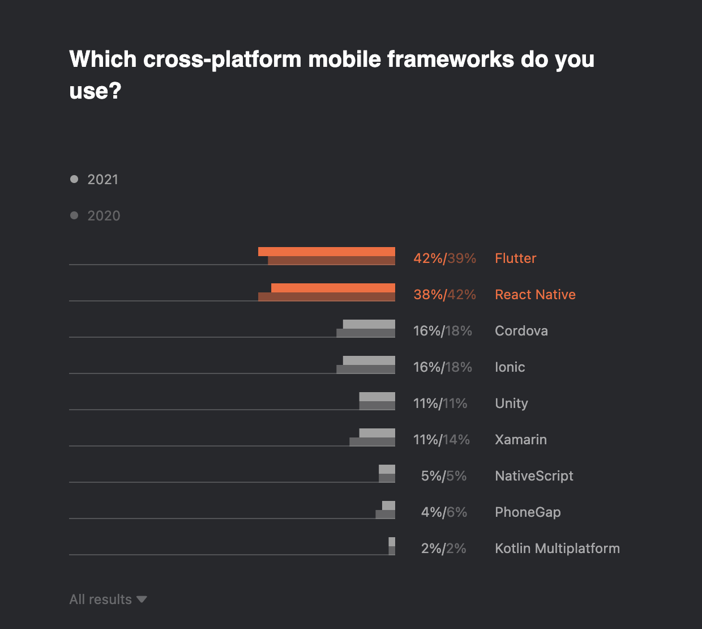

# Should You Choose Flutter?

Flutter is one of the burning technology in the market today. People are using Flutter to build all sorts of Mobile applications. Not only that, Flutter is being used to develop many web and desktop applications. Now the question is, should you choose Flutter if you are trying to build a mobile, web, or desktop application for your client? How do you decide whether or not to use Flutter for your next project? We will talk about those in this article.

<!-- truncate -->

## What is Flutter?

Flutter is a cross-platform UI toolkit from Google. As of version 3.x, Flutter helps build the application for six major platforms from a single codebase. Using Flutter, you can build an application that runs on Android, iOS, Windows, Linux, macOS, and the Web without changing your code. Same application builds for all six platforms (you must make sure you use dependencies that support all the platforms if you plan to develop for all the platforms). Flutter is highly used to build mobile applications that target Android and iOS. Flutter for desktop and web applications is also rising in its use.

Flutter is the most popular tool according to the State of Developer Ecosystem Survey by JetBrains. ([https://www.jetbrains.com/lp/devecosystem-2021/miscellaneous](https://www.jetbrains.com/lp/devecosystem-2021/miscellaneous))

## When Should You Invest in Flutter?

- If you are a company that builds applications for clients, I believe investing in Flutter will be a valuable decision. With Flutter's expertise in the team, you can deliver competitive development and maintenance costs to your clients who want to build applications for more than one platform.
- If you are a startup trying to launch a mobile application for your project, investing in Flutter is the right choice if your application fits the traits mentioned above. As with Flutter, even if you start with one platform initially, you can quickly expand to other platforms and target other potential customers.
- If you are someone trying to enter the developer market and are interested in the mobile ecosystem, Flutter can be the best career choice. There is high demand for skilled Flutter developers. And there are lots of learning resources to get you from the beginning to advance in Flutter development.
- If you are a student, learner, or someone who wants to learn, Flutter can still be a good choice. You will be able to understand the new programming language Dart. You will learn the fundamentals of cross-platform development. And you will gain the skill to build mobile, web, and desktop applications.

## When Should You Choose Flutter for Mobile Projects?

- If you are building or planning to develop the application for both Android and iOS
- If you or your client plan on introducing a desktop application for your project, you will be able to build your desktop application from the same codebase
- If your application needs beautiful and high-performance UIs
- If your team already has Flutter knowledge
- If you or your client needs a quick and cost-effective solution to build your application

## When Not to Choose Flutter for Mobile Projects?

- If your team’s expertise is in another cross-platform framework like React Native, it might also be the better choice at the moment. However, Flutter seems to be more and more popular these days.
- If your application needs 3D capabilities
- If your application is heavily using AR/VR capabilities
- If you are building an application for a single platform and never plan to build the same for another platform.

## When to Choose Flutter for Web Applications?

- You are building a highly interactive web application
- You are building a Progressive Web Application (PWA) which is a web application that behaves like a native application
- You are building a web version of an already existing mobile application
- You are planning to build and deploy your application for all major platforms
